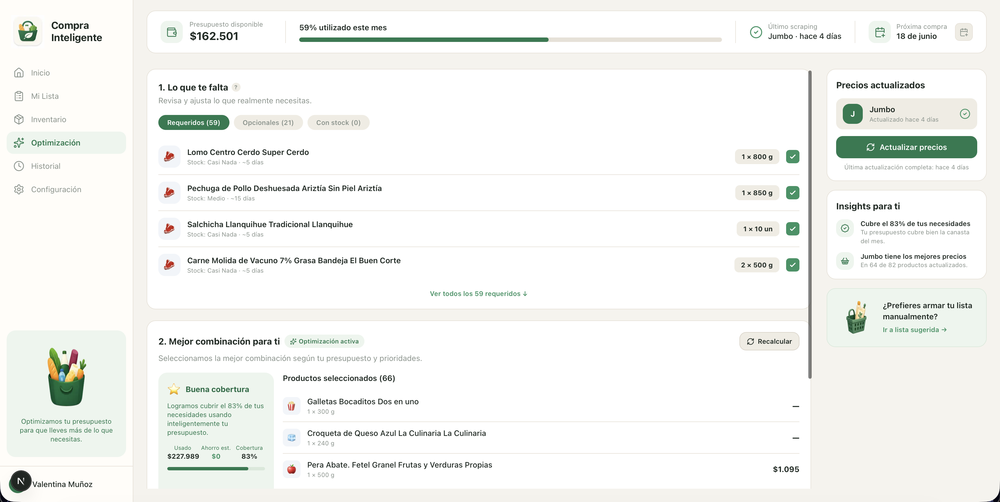

# Compra Inteligente

Sistema de optimización de compras de supermercado orientado al control de presupuesto, gestión de inventario doméstico y toma de decisiones de compra basada en datos reales.

El proyecto nació como una solución personal para reducir tiempo de planificación, evitar compras innecesarias y optimizar el presupuesto mensual considerando hábitos reales de consumo.

## Características principales

- Gestión de inventario doméstico
- Presupuesto mensual configurable
- Optimización automática de compras
- Web scraping de precios desde supermercado
- Integración de boletas mediante carga manual
- Matching automático por código de barras
- Compartir lista optimizada vía WhatsApp
- Programación inteligente de próximas compras
- Integración con Google Calendar

## Cómo funciona

El sistema combina:

- Inventario doméstico actualizado
- Historial y planificación de compras
- Presupuesto disponible
- Historial de compras
- Precios actualizados mediante scraping
- Restricciones temporales de compra

para generar una lista de compra optimizada.

Además, el motor considera preferencias reales de compra, como días con descuentos bancarios, frecuencia mensual de compras, fechas objetivo, prioridad de productos, stock disponible.

## Arquitectura

El proyecto integra múltiples componentes:

- Frontend web responsive
- Motor de recopilación y actualización de precios
- Gestión de inventario
- Persistencia de datos
- Motor de optimización
- Integraciones externas
- Automatización de flujos

## Stack tecnológico

### Frontend

- React
- TypeScript
- TailwindCSS

### Backend / Infraestructura

- Supabase
- PostgreSQL

### Automatización

- Web Scraping
- Integración Google Calendar
- Integración WhatsApp

## Motivación

La mayoría de las aplicaciones de compras se limitan a listas manuales. Este proyecto busca resolver un problema más amplio:

> ¿Cómo optimizar las compras del supermercado considerando presupuesto, inventario, precios reales y hábitos de consumo?

## Estado actual

Sistema personal en desarrollo continuo, utilizado para la gestión y optimización real de mis compras domésticas.

## Capturas

## Roadmap

- OCR para procesamiento automático de boletas
- Comparación multi-supermercado
- Predicción de consumo
- Recomendaciones inteligentes
- Optimización multi-objetivo
- Notificaciones automáticas

## Demo pública
El proyecto actualmente utiliza datos personales reales de consumo e inventario, por lo que la URL pública no se encuentra disponible.
Las capturas y documentación reflejan funcionalidades reales implementadas en el sistema.
