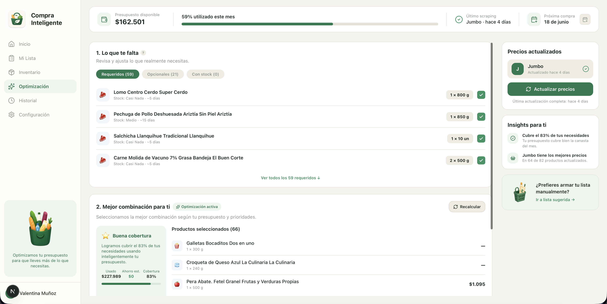

# Compra Inteligente

Sistema de optimización de compras de supermercado orientado al control de presupuesto, gestión de inventario doméstico y toma de decisiones de compra basada en datos reales.

El proyecto nació como una solución personal para reducir tiempo de planificación, evitar compras innecesarias y optimizar el presupuesto mensual considerando hábitos reales de consumo.

## Características principales

- Gestión de inventario doméstico
- Presupuesto mensual configurable
- Optimización automática de compras
- Web scraping de precios desde supermercado
- Registro manual de compras del mes
- Compartir lista optimizada vía WhatsApp
- Días de compra marcados en un calendario mensual
- Integración con Google Calendar

## Cómo funciona

El sistema combina:

- Lista de compras del hogar
- Inventario actual de mercaderia
- Presupuesto disponible
- Historial de compras
- Precios actualizados mediante scraping
- Restricciones temporales de compra

para generar una lista de compra optimizada.

Además, el motor considera preferencias reales de compra, como:

- días con descuentos bancarios
- frecuencia mensual de compras
- fechas objetivo
- prioridad de productos
- stock disponible

## Arquitectura

El proyecto integra múltiples componentes:

- Frontend web responsive
- Sistema de scraping automatizado
- Gestión de inventario
- Persistencia de datos
- Motor de optimización
- Integraciones externas
- Automatización de flujos

## Stack tecnológico

### Frontend

- React
- TypeScript
- TailwindCSS

### Backend / Infraestructura

- Supabase
- PostgreSQL

### Automatización

- Web Scraping
- Integración Google Calendar
- Integración WhatsApp

## Motivación

La mayoría de las aplicaciones de compras se limitan a listas manuales.

Este proyecto busca resolver un problema más amplio:

> ¿Cómo optimizar las compras del supermercado considerando presupuesto, inventario, precios reales y hábitos de consumo?

## Estado actual

Proyecto personal en desarrollo activo.

## Capturas

## Roadmap

- Comparación multi-supermercado
- Predicción de consumo
- Recomendaciones inteligentes
- Optimización multi-objetivo
- Notificaciones automáticas

## Autor

Valentina Muñoz

Frontend / Full Stack Engineer focused on building systems, automation and practical software solutions.
